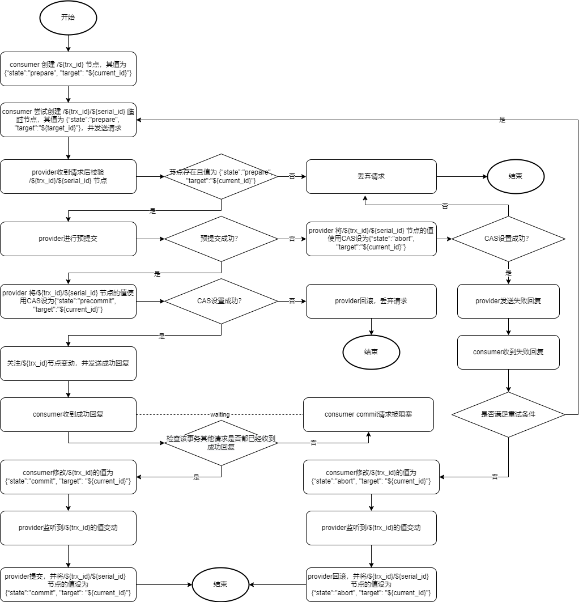

# clrpc

这是一个基于 `Java` 的分布式远程过程调用工具。

服务提供者注册到注册中心后，服务消费者查询服务，挑选合适的服务提供者并调用服务（支持同步调用和异步调用）。

[](http://apache.org/licenses/LICENSE-2.0)

## Setup

当前阶段均为 `SNAPSHOT` 版本，暂时不提供依赖配置。

你可以使用命令 `git clone git@github.com:CongLinDev/clrpc.git` 克隆到本地自行打包。

## Usage

### Define Service And Implement it

```java
// define a service interface
interface EchoService {
    String hello(String arg);
    String hi(String arg);
}

// implements interface EchoService
class EchoServiceImpl implements EchoService {
    @Override
    public String hello(String arg) {
        return "Hello " + arg;
    }

    @Override
    public String hi(String arg) {
        return "Hi " + arg;
    }
}
```

### Service Provider

```java
// 创建简单的服务对象
ServiceObject<EchoService> serviceObject = new SimpleServiceObject.Builder<>(EchoService.class)
        .name("EchoService")
        .object(new EchoServiceImpl())
        .build();

// 创建服务提供者
ProviderBootstrap bootstrap = new ProviderBootstrap();

// 发布服务并开启服务
bootstrap.registry(ZooKeeperServiceRegistry.class) // 设置注册中心
        .publish(serviceObject) // 发布服务对象
        .hookStop() // 注册关闭钩子，用于优雅关闭服务提供者
        .start(new CommonOption());
```

### Service Consumer

```java
// 创建简单的服务接口对象
ServiceInterface<EchoService> serviceInterface = new SimpleServiceInterface.Builder<>(EchoService.class)
        .name("EchoService")
        .build();

// 创建服务消费者
ConsumerBootstrap bootstrap = new ConsumerBootstrap();
// 开启服务消费者
bootstrap.registry(ZooKeeperServiceRegistry.class)
        .start(new CommonOption());

// 提前刷新需要订阅的服务
bootstrap.subscribe(serviceInterface);

//使用同步服务
EchoService syncService = bootstrap.syncService(serviceInterface);
String result = syncService.hello("I am consumer!"); // 一直阻塞，直到返回结果

// 使用异步服务
EchoService asyncService = bootstrap.asyncService(serviceInterface);
String fakeResult = asyncService.hello("I am consumer!"); // 直接返回默认值
assert fakeResult == null;
InvocationFuture future = InvocationContext.lastContext().getFuture(); // 获取该线程最新一次操作的产生的future对象
future.callback(new Callback() { // 使用回调处理结果
    @Override
    public void success(Object res) {}
    @Override
    public void fail(Exception e) {}
});

// 关闭服务消费者
bootstrap.stop();
```

### Service Consumer (With Transaction)

```java
// 创建服务接口对象
ServiceInterface<EchoService> serviceInterface = new SimpleServiceInterface.Builder<>(EchoService.class)
        .name("EchoService")
        .build();

// 创建服务消费者
ConsumerBootstrap bootstrap = new ConsumerBootstrap();
// 开启服务消费者
bootstrap.registry(ZooKeeperServiceRegistry.class)
        .start(new CommonOption());

// 提前刷新需要订阅的服务
bootstrap.subscribe(serviceInterface);

TransactionManager manager = (TransactionManager)bootstrap.object(ZooKeeperTransactionManager.class);
EchoService service = manager.asyncService(serviceInterface); // get proxy from TransactionManager instead of bootstrap

manager.begin(); // 事务开启

service.hello("first request"); // 异步发送第一条请求
InvocationFuture f1 = InvocationContext.lastContext().getFuture(); // 获取第一条请求产生的future对象
service.hi("second request"); // 异步发送第二条请求
InvocationFuture f2 = InvocationContext.lastContext().getFuture(); // 获取第二条请求产生的future对象

TransactionInvocationContext context = manager.commit(); // 事务提交 返回事务 上下文

// 销毁 TransactionManager
ObjectLifecycleUtils.destroy(manager);
// 关闭服务消费者
bootstrap.stop();
```

### Annotations Supports

```java
@ServiceInterface(name = "EchoService")
interface EchoService {
    String hello(String arg);
    String hi(String arg);
}

@ServiceObject(interfaceClass = EchoService.class, name = "EchoService")
class EchoServiceImpl implements EchoService {
    @Override
    public String hello(String arg) {
        return "Hello " + arg;
    }

    @Override
    public String hi(String arg) {
        return "Hi " + arg;
    }
}
```

```java
// build ServiceInterface
ServiceInterface<EchoService> serviceInterface = new AnnotationServiceInterface<>(EchoService.class);

// build ServiceObject
ServiceObject<EchoService> serviceObject = new AnnotationServiceObject<>(EchoServiceImpl.class);
```

## Config

默认配置文件名为 `config.properties`。

[默认配置文件模板](https://github.com/CongLinDev/clrpc/blob/master/src/main/resources/config.properties)。

### Config File

配置文件位置默认在项目 `resources` 目录下，默认格式为 `properties` ，默认文件为 `config.properties`。

### Config Items

|              Field               |  Type   | Required | Default |           Remark            |
| :------------------------------: | :-----: | :------: | :-----: | :-------------------------: |
|      provider.registry.url       |   URL   |   TRUE   |         |        注册中心地址         |
|       provider.instance.id       | String  |   True   |         |        服务提供者id         |
|    provider.instance.address     | String  |   True   |         |       服务提供者地址        |
|    provider.io-thread.number     | Integer |  False   |    4    |    服务提供者的IO线程数     |
|      consumer.registry.url       |   URL   |   TRUE   |         |        注册中心地址         |
|       consumer.instance.id       | String  |   True   |         |        服务消费者id         |
|    consumer.io-thread.number     | Integer |  False   |    4    |    服务使用者的IO线程数     |
|   consumer.retry.check-period    | Integer |  False   |  3000   | 重试机制执行周期 单位是毫秒 |
| consumer.retry.initial-threshold | Integer |  False   |  3000   | 初始重试时间门槛 单位是毫秒 |

| consumer.retry.initial-threshold | Integer |  False   |  3000   | 初始重试时间门槛 单位是毫秒 |
(new UrlScheme("zookeeper://127.0.0.1:2181/clrpc"))

### Extension Config Items

|          Field          | Type  | Required | Default |             Remark             |
| :---------------------: | :---: | :------: | :-----: | :----------------------------: |
| extension.atomicity.url |  URL  |   True   |         | 原子服务地址，目前用于事务管理 |

#### About Customized Address Url

配置项中的 `provider.registry.url` `consumer.registry.url` 为必填项，其url解析规则如下：

`zookeeper://127.0.0.1:2181/clrpc?session-timeout=5000`

1. 协议名，如 `zookeeper`；
2. 服务地址部分，如 `127.0.0.1:2181`；
3. 根节点部分，如 `/clrpc` （若未给出默认为 `/` ）；
4. 参数部分，如 `session-timeout=5000` 。

## Distributed Transaction

**clrpc** 使用 **ZooKeeper** 实现了类似于两段式提交(2PC)的分布式事务协调服务。

注意：该服务仅支持 返回值为 `conglin.clrpc.extension.transaction.TransactionResult` 及其子类的服务方法。不满足条件的服务方法执行方式与普通调用相同。

1. 阶段一 执行服务方法，并返回 `conglin.clrpc.extension.transaction.TransactionResult` 对象。并通过 `conglin.clrpc.extension.transaction.TransactionResult#result()` 方法获取一阶段提交结果，返回给调用者。
2. 阶段二 从 `conglin.clrpc.extension.transaction.TransactionResult#callback()` 获取 `conglin.clrpc.common.Callback` 对象。根据实际需求执行 `conglin.clrpc.common.Callback#success(Object)` 或 `conglin.clrpc.common.Callback#fail(Exception)` 方法。

流程图如下：



## Bootstrap Extension

### Registery

使用者通过实现 `conglin.clrpc.service.registry.ServiceRegistry` 接口来实现注册中心。

在启动前通过 `conglin.clrpc.bootstrap.Bootstrap#registry(Class<? extends ServiceRegistry>)` 传入即可完成对注册中心的扩展。

**clrpc** 提供一个基于 **ZooKeeper** 的实现：`conglin.clrpc.thirdparty.zookeeper.registry.ZooKeeperServiceRegistry` 。

### Load Balancer

使用者通过实现 `conglin.clrpc.common.loadbalance.LoadBalancer` 接口来实现负载均衡器。

在订阅服务时通过 `conglin.clrpc.bootstrap.ConsumerBootstrap#subscribe(ServiceInterface<?>, Class<? extends LoadBalancer<?, ?>>)` 传入即可完成对注册中心的扩展。

对于不同的服务，允许使用不同的负载均衡器即可以使用不同的负载均衡策略。

**clrpc** 提供三种策略实现：

1. 基于树的一致性哈希。（默认策略）
2. 基于数组的随机。
3. 基于数组的轮询。

### Identifier Generator

使用者通过实现 `conglin.clrpc.common.identifier.IdentifierGenerator` 接口来实现ID生成器。

在启动时通过 `conglin.clrpc.bootstrap.option.BootOption#identifierGenerator(IdentifierGenerator)` 传入即可完成对ID生成器的扩展。

**clrpc** 提供四种策略实现：

1. 雪花算法。（默认策略）
2. 随机数生成。
3. 基于ZooKeeper的全局顺序id生成。
4. 基于ZooKeeper的服务顺序id生成。

### Serialization Handler

使用者通过实现 `conglin.clrpc.common.serialization.SerializationHandler` 接口来实现序列化处理器。

在启动时通过 `conglin.clrpc.bootstrap.option.BootOption#serializationHandler(SerializationHandler)` 传入即可完成对序列化处理器的扩展。

**clrpc** 提供一种策略实现：

1. Protostuff。（默认策略）

### Service Instance Codec

使用者通过实现 `conglin.clrpc.service.instance.codec.ServiceInstanceCodec` 接口来实现ServiceInstance序列化处理器。

在启动时通过 `conglin.clrpc.bootstrap.option.BootOption#serviceInstanceCodec(SerializationHandler)` 传入即可完成对ServiceInstance序列化处理器的扩展。

### Protocol Definition

使用者通过实现 `conglin.clrpc.transport.protocol.ProtocolDefinition` 接口来实现消息类型协议。

在启动时通过 `conglin.clrpc.bootstrap.option.BootOption#protocolDefinition(ProtocolDefinition)` 传入即可完成对消息类型协议的扩展。

### Message Handler

**clrpc** 利用了 **Netty** 的 `ChannelPipeline` 作为处理消息的责任链，并提供消息处理扩展点。

使用者实现 `conglin.clrpc.service.handler.factory.ChannelHandlerFactory` 接口来创建工厂。

在启动时通过 `conglin.clrpc.bootstrap.option.BootOption#channelHandlerFactory(ChannelHandlerFactory)` 传入即可完成对消息处理的扩展。

## Service Interface Extensions

### Fail Strategy

使用者通过实现 `conglin.clrpc.service.strategy.FailStrategy` 接口来提供请求失败策略。

**clrpc** 提供三种策略实现：

1. FailFast: 失败时抛出异常。（默认策略）
2. FailOver: 失败时重试。
3. FailSafe: 失败时不抛出异常，返回默认值。

使用者可以根据需求，任意组合或自定义失败策略。

### Timeout Threshold

请求超时时间，单位是毫秒。若小于0则永不超时。

### Instance Condition

使用者通过实现 `conglin.clrpc.service.instance.condition.InstanceCondition` 接口来选择服务实例。

## Object Lifecycle

使用者可以通过提供对象并实现以下接口来保证自己的扩展对象拥有 **clrpc** 对象生命周期。

1. 使用前
   1. conglin.clrpc.service.context.ComponentContextAware
   2. conglin.clrpc.common.Initializable
2. 使用后
   1. conglin.clrpc.common.Destroyable (没有经过托管的对象不具备该周期，需要开发者手动处理)

## Method Lookup

**clrpc** Provider 处同时支持以下两种方式的方法查询。

1. 第一种为普通方式：该方式使用 `java.lang.Class#getMethod(String, Class<?>[])` 在执行时查找对应的 `Method`。
2. 第二种为 **clrpc** 自定义方式（不支持用户自定义）：该方式使用缓存的方式保存服务 `Method`。
   1. 当用户发布对应的服务时，会对该服务下的所有 `Method` 进行分类缓存。
   2. 分类的规则为重载的 `Method` 且其参数个数，例如 `#hello(String, Object)` 的缓存key为 `$hello$2`。
   3. 对于缓存key相同的 `Method` ，根据其 `Method` 参数类型继承顺序进行排序，例如 `#hello(String, Integer)` 将排在 `#hello(String, Object)` 前面。
   4. 执行时根据请求参数类型按顺序匹配 `Method` 参数类型。

Customer 处需要配合代理来选择使用哪种方式。

对于 `conglin.clrpc.service.proxy.ServiceInterfaceObjectProxy` 及其子类默认使用第二种方式。

若需要更换方法查询方式，对方法 `conglin.clrpc.service.proxy.AbstractObjectProxy#getMethodName(Method)` 重写即可。

## License

[Apache 2.0](http://apache.org/licenses/LICENSE-2.0)
